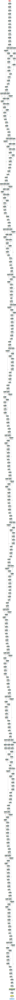

# dl4jgrapher
Classes to generate Graphviz DOT files from DL4J MultiLayerNetworks and ComputationGraphs

For prototyping for example, with VS Code as your IDE, you can use João Pinto's excellent Graphviz (dot) language support extension (https://github.com/joaompinto/vscode-graphviz) to preview the generated DOT file alongside the dl4j code. You can also use Graphviz tools (https://graphviz.org/) to generate files in formats such as pdf, png, svg etc. from the DOT file for display / publication purposes.

# Installation

## SBT
In build.sbt:

```scala
libraryDependencies += "com.drissoft" %% "dl4jgrapher" % "0.1.0"
```

# Scala Examples

[AlexNet](#AlexNet-Output)

[ResNet50](#ResNet50-Output)

[InceptionResNetV1](#InceptionResNetV1-Output)

## MultiLayerNetwork

### AlexNet

```scala
import org.deeplearning4j.zoo.model.AlexNet
import com.drissoft.dl4jgrapher._

val h = 224
val w = 224
val c = 3
val inputType = new InputType.InputTypeConvolutional(h, w, c)

// Build AlexNet
val net = AlexNet
  .builder()
  .numClasses(10)
  .build()
  .init()

val input   = Nd4j.rand(1, c, h, w)
val grapher = new MultiLayerNetworkGrapher(net).getGrapher(input, inputType)

// Output the DOT file
grapher.writeDotFile(java.nio.file.Paths.get("alexnet.dot"))
```

### Graphviz

```powershell
<Graphviz Dir>\bin\dot.exe -Tsvg alexnet.dot -o alexnet.svg
```

### AlexNet Output


## ComputationGraph

### ResNet50

```scala
import org.deeplearning4j.zoo.model.ResNet50
import com.drissoft.dl4jgrapher._

val h = 224
val w = 200
val c = 3
val inputTypes = List(new InputType.InputTypeConvolutional(h, w, c))

// Build ResNet50
val net = ResNet50
  .builder()
  .numClasses(10)
  .build()
  .init()

val input   = Nd4j.rand(1, c, h, w)
val grapher = new ComputationGraphGrapher(net).getGrapher(Array(input), inputTypes)

// Output the DOT file
grapher.writeDotFile(java.nio.file.Paths.get("resnet.dot"))
```

### ResNet50 Output


### InceptionResNetV1 Output

