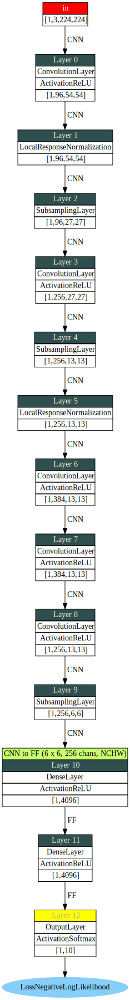

# dl4jgrapher
Classes to create Graphviz DOT files of DL4J MultiLayerNetworks and ComputationGraphs

For prototyping for example, with VS Code as your IDE, you can use João Pinto's excellent Graphviz (dot) language support extension (https://github.com/joaompinto/vscode-graphviz) to preview the generated DOT file alongside the dl4j code. Also can use Graphviz tools (https://graphviz.org/) to generate files in formats such as pdf, png, svg etc. from the DOT file for display / publication purposes.

# Scala Example

```scala
import com.drissoft.dl4jgrapher._

val h = 224
val w = 224
val c = 3
val inputType = new InputType.InputTypeConvolutional(h, w, c)

// Build AlexNet
val net = AlexNet
  .builder()
  .numClasses(10)
  .build()
  .init()

val input   = Nd4j.rand(1, c, h, w)
val grapher = new MultiLayerNetworkGrapher(net).getGrapher(input, inputType)

// Output the DOT file
grapher.writeDotFile(java.nio.file.Paths.get("alexnet.dot"))
```

# Example Output

